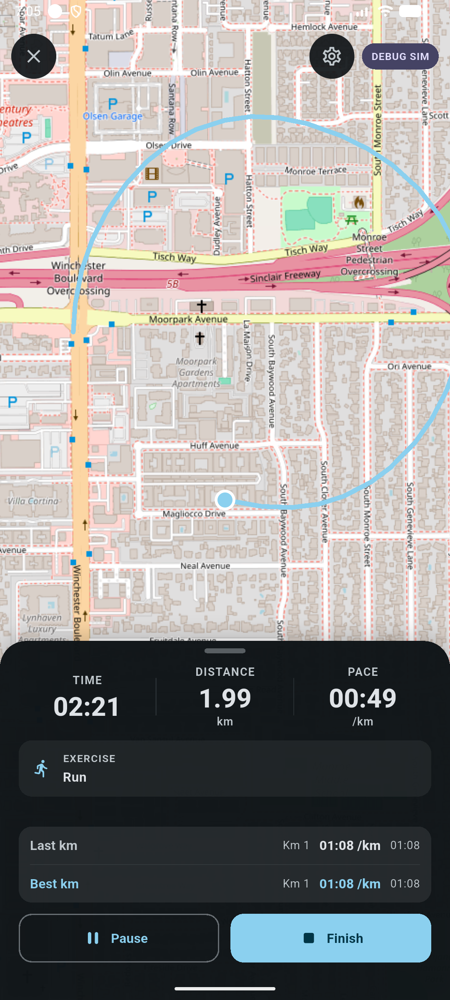
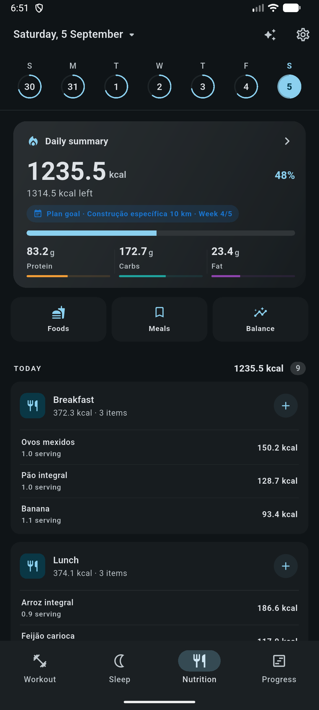
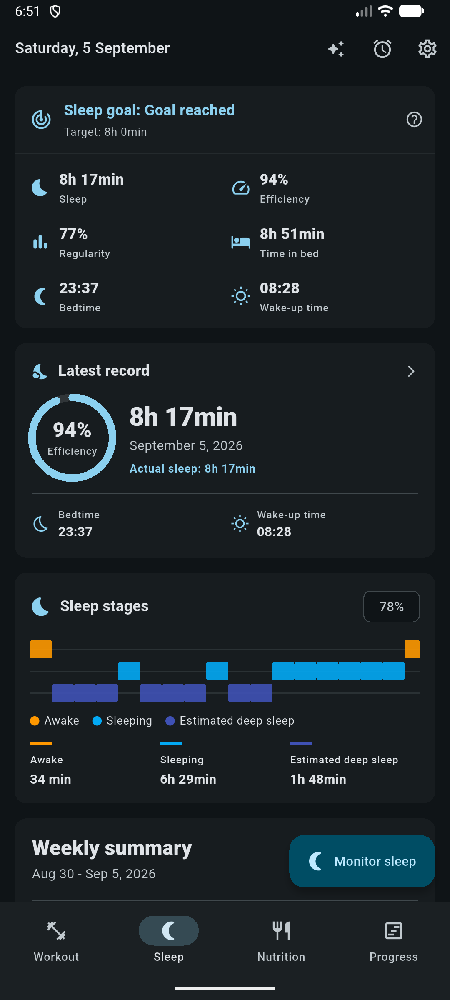
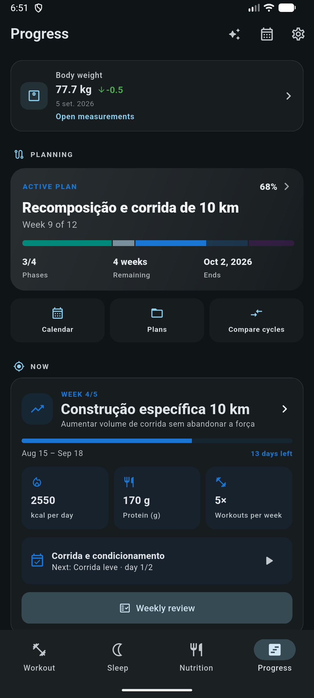

<h1 align="center">Workout Notes</h1>

<p align="center">
  <a href="https://www.linkedin.com/in/rafael-goulartb/">
    
  </a>
  <a href="https://github.com/RafaelGoulartB/workout-notes#readme">
    
  </a>
  <a href="https://github.com/RafaelGoulartB/workout-notes/graphs/commit-activity">
    
  </a>
  <a href="https://github.com/RafaelGoulartB/workout-notes/blob/main/LICENSE">
    
  </a>
  <a href="https://github.com/RafaelGoulartB/workout-notes/actions/workflows/release-android.yml">
    
  </a>
  
  
  
</p>

<p align="center">
  Training, nutrition, sleep, and progress in one local-first app.
</p>

Workout Notes brings strength training, GPS runs, food logging, sleep tracking, and body measurements together. Build routines, follow a periodized plan, and see how your habits change over time. Your journal lives on your device, with no account required.

Built with Flutter and Material 3, with English and Brazilian Portuguese, metric and imperial units, light and dark themes, and a customizable accent color. **Android is the most complete target**: background tracking, sleep monitoring, alarms, barcode scanning, and run voice coaching rely on native Android integrations.

## Train and track your progress

- **Strength training:** log sets, weight, reps, warm-ups, RPE, and notes. Build multi-day routines, group supersets, use rest timers, and review completed sessions.
- **Running and cardio:** record GPS routes or stationary-bike sessions, follow running plans and intervals, and use voice coaching. Review pace, splits, route replays, records, and trends.
- **Goals and measurements:** follow training volume, frequency, personal records, and an annual heatmap. Track weight, body composition, circumferences, and progress photos.

<table>
  <tr>
    <th width="33%">Live strength workout</th>
    <th width="33%">Live run tracking</th>
    <th width="33%">Training progress</th>
  </tr>
  <tr>
    <td><a href="assets/screenshots/workout-progress.png"></a></td>
    <td><a href="assets/screenshots/run-progress.png"></a></td>
    <td><a href="assets/screenshots/progress.png"></a></td>
  </tr>
</table>

Also explore [completed run analysis](assets/screenshots/run.png) and [body measurements](assets/screenshots/body-measurements.png).

## Connect food, recovery, and planning

- **Nutrition:** keep a daily food diary with calorie and macro targets, saved meals, food search, barcode lookup, and nutrition trends.
- **Sleep:** log nights or monitor sleep on Android. Review duration, efficiency, regularity, estimated sleep stages, and weekly summaries; configure alarms and a sleep goal.
- **Periodization:** organize training into phases and weeks, link routines and running plans, set nutrition, training, weight, and sleep targets, and review check-ins or compare cycles.

<table>
  <tr>
    <th width="33%">Nutrition diary</th>
    <th width="33%">Sleep and recovery</th>
    <th width="33%">Periodization</th>
  </tr>
  <tr>
    <td><a href="assets/screenshots/nutrition.png"></a></td>
    <td><a href="assets/screenshots/sleep.png"></a></td>
    <td><a href="assets/screenshots/periodization.png"></a></td>
  </tr>
</table>

<sub>Captured from the Android emulator in dark mode; the live run uses simulated GPS. Tap an image to view it at full resolution.</sub>

## Optional AI Coach

Connect your own OpenAI-compatible provider to discuss training, running, nutrition, and recovery using context from your journal. Configure the provider URL, API token, and model in **Settings > Configure AI**.

When used, the coach sends conversation and relevant app data to your chosen provider. Routine and manual-food changes are presented as proposals for approval before they are applied. Credentials stay in platform secure storage; no API key or hosted AI service is bundled.

## Your data

Core logging works locally in SQLite. Online features such as AI, map tiles, and remote food lookup need connectivity. Export and restore a compact JSON backup for device migration, or export workouts as CSV and share session summaries.

Backups include essential history, preferences, and progress photos, but exclude API tokens, AI conversations and proposals, detailed sleep stages, permissions, and active background sessions.

## Run locally

Use a Flutter SDK with Dart **3.12.1 or a compatible newer 3.x version**, Android tooling, and an emulator or physical device.

```bash
flutter doctor
flutter pub get
flutter run
```

## Development

The app uses `setState` and `ChangeNotifier`, SQLite repositories, and Kotlin services for Android background features. Feature code lives in `lib/screens`, `lib/services`, and `lib/repositories`; shared plan logic lives in `lib/periodization`.

```bash
flutter gen-l10n
flutter analyze
flutter test
flutter build apk --release
```

For native unit tests, run `./gradlew test` from `android/` (`.\gradlew.bat test` on Windows). See [AGENTS.md](AGENTS.md) for architecture, migrations, localization, and contribution conventions. Issues and pull requests are welcome.

The Android release workflow validates app changes on `main` before building an APK. README and screenshot-only changes do not trigger it; manual runs are available in Actions.

## License

[MIT](LICENSE) · [Rafael Goulart](https://www.linkedin.com/in/rafael-goulartb/)
