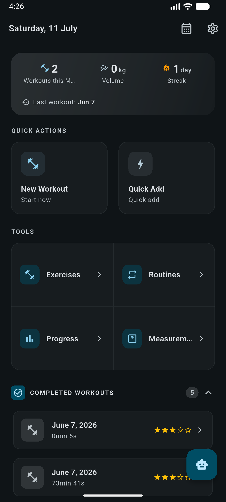
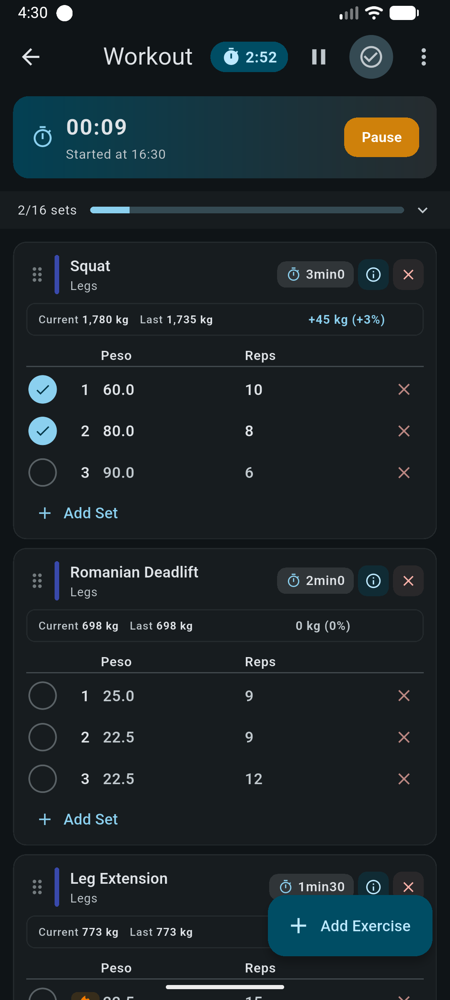
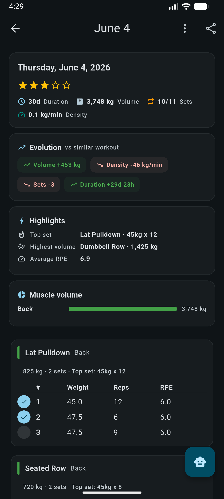
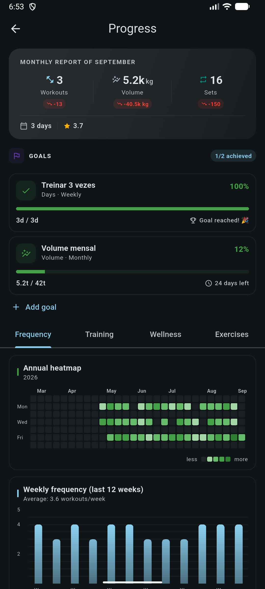
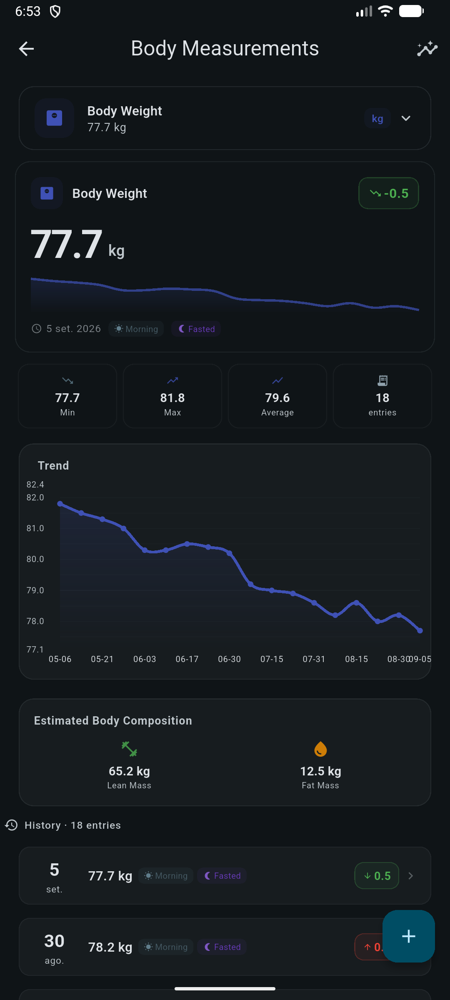

# Workout Notes

Workout Notes is a local-first workout journal built with Flutter. It is designed for recording strength and cardio sessions, following routines, and understanding progress without sending workout data to a hosted account.

The app combines a practical workout logger with history, goals, body measurements, detailed charts, and an optional AI coach that connects to an OpenAI-compatible provider chosen by the user.

## Screenshots

<p align="center">
  
  
  
</p>

<p align="center">
  
  
</p>

## Features

### Workout logging

- Record strength and cardio workouts with a live session timer.
- Track weight, repetitions, distance, time, warm-up sets, RPE, and notes.
- Configure rest times per exercise and use automatic rest-timer notifications.
- Reorder exercises, group supersets, pause a session, or return to a workout already in progress.
- Add a past workout quickly when a live session is not needed.
- Review each completed session with volume, density, highlights, muscle-group distribution, and comparison with a similar workout.

### Exercises and routines

- Browse, search, favorite, and create exercises.
- Organize exercises by category, equipment, and training type.
- Build reusable multi-day routines with predefined sets and rest periods.
- Plan workouts for future dates and review training history from the calendar.

### Progress and goals

- See monthly reports, training streaks, total volume, workout frequency, and an annual heatmap.
- Follow strength, cardio, duration, recovery, and body-composition trends.
- Inspect exercise history and personal records.
- Create measurable goals and track the workouts that contribute to them.

### Body measurements

- Track weight, body composition, circumferences, and other measurements over time.
- Compare left and right measurements for bilateral entries.
- View trends, summaries, averages, and measurement history.
- Attach progress photos to measurement entries.

### AI Coach

The optional AI Coach can discuss training history and help with routine planning. It supports user-configured OpenAI-compatible providers, models, and system prompts.

The coach receives workout context only when used. API credentials are stored with the platform's secure storage, and the app does not include a hosted AI service or bundled API key. Read tools let the coach inspect local training data; routine changes are created as proposals and are applied only after explicit approval in the app.

### Data and customization

- Store workout data locally in SQLite; no account is required.
- Export and restore a complete JSON backup.
- Export workout data as CSV and share completed sessions.
- Switch between metric and imperial units.
- Choose English or Brazilian Portuguese.
- Use light, dark, or system theme with a selectable accent color.

## Tech stack

- [Flutter](https://flutter.dev/) and Dart
- Material 3
- SQLite with `sqflite`
- `fl_chart` for analytics and progress charts
- `flutter_local_notifications` for workout and rest timers
- `shared_preferences` and `flutter_secure_storage` for settings and credentials
- `http` for OpenAI-compatible AI providers

The project intentionally uses lightweight state management: local `setState` for screen state and `ChangeNotifier` for shared services and settings.

## Getting started

### Requirements

- Flutter SDK compatible with Dart 3.12 or newer
- Android Studio or Xcode, depending on the target platform
- A configured emulator or physical device

Check your environment before installing dependencies:

```bash
flutter doctor
flutter pub get
```

Run the app:

```bash
flutter run
```

To use the AI Coach, open **Settings > Configure AI** and add the base URL, API token, and model for an OpenAI-compatible provider. The rest of the app works without AI configuration.

## Development

Generate localization files, run static analysis, and execute the test suite with:

```bash
flutter gen-l10n
flutter analyze
flutter test
```

Build an Android APK with:

```bash
flutter build apk
```

## Project structure

```text
lib/
├── database/       SQLite setup, migrations, and seed data
├── l10n/           English and Brazilian Portuguese translations
├── models/         Workout, goal, and AI chat models
├── navigation/     Shared navigation helpers
├── repositories/   Data access and domain queries
├── screens/        App screens and workout flows
├── services/       Timers, exports, notifications, and AI integrations
├── state/          Shared ChangeNotifier services
├── utils/          Formatting and calculation helpers
└── widgets/        Reusable UI components
```

Workout data is persisted in SQLite. Settings use a mix of SQLite and `shared_preferences`, while AI provider tokens are kept in secure platform storage.

## Contributing

Issues and pull requests are welcome. For larger changes, open an issue first so the approach can be discussed before implementation.

When submitting a change:

1. Keep the existing local-first architecture and Material 3 design conventions.
2. Add visible text to both ARB localization files.
3. Include migrations for database schema changes.
4. Run `flutter analyze` and `flutter test`.
5. Add or update tests when changing repositories, services, or database behavior.
